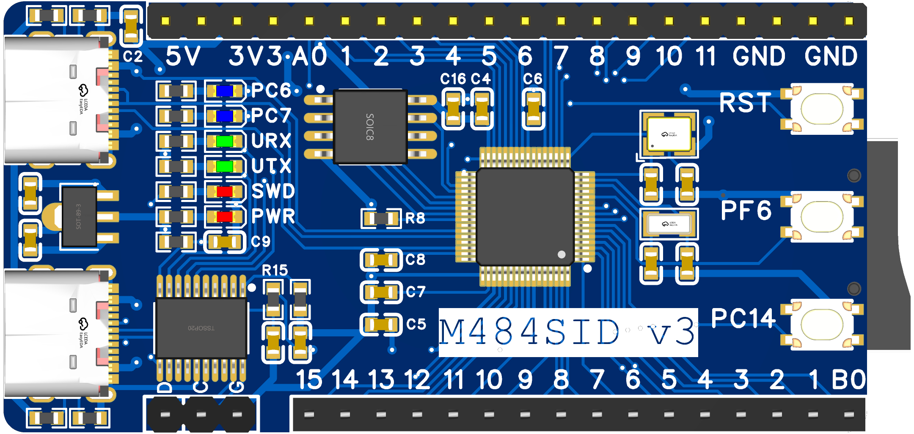

MicroPython ports to:
  - Nuvoton M480, Cortex-M4 MCU, 192MHz, 512KB Flash, 160KB SRAM

The firmware is tested on board [https://oshwhub.com/xivn1987/M484SID](https://oshwhub.com/xivn1987/M484SID), using demo code at [ports/m480/README.md](ports/m480/README.md)



## Build
``` bash
$ cd ports/m480
$ make
```
